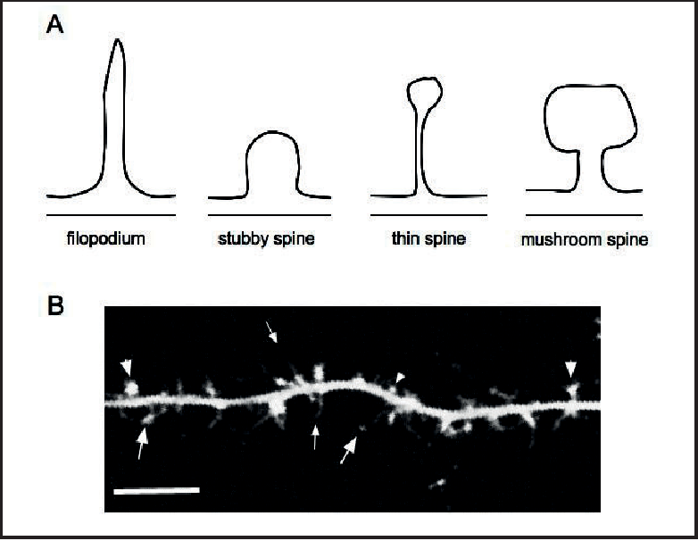
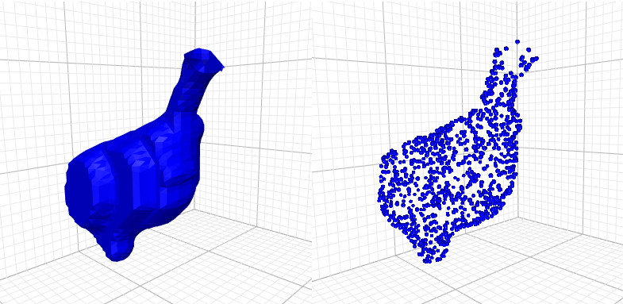
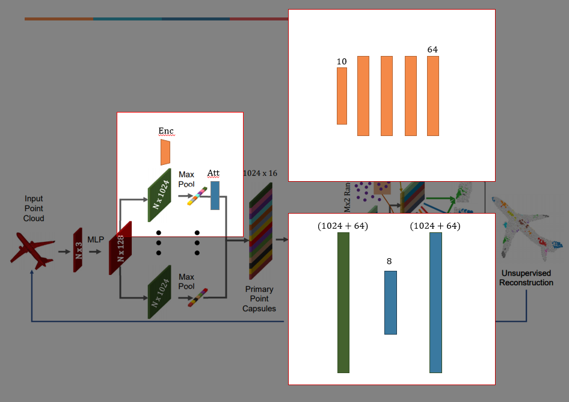
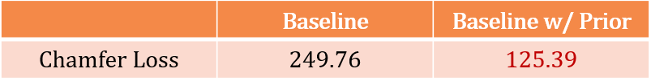
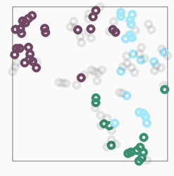
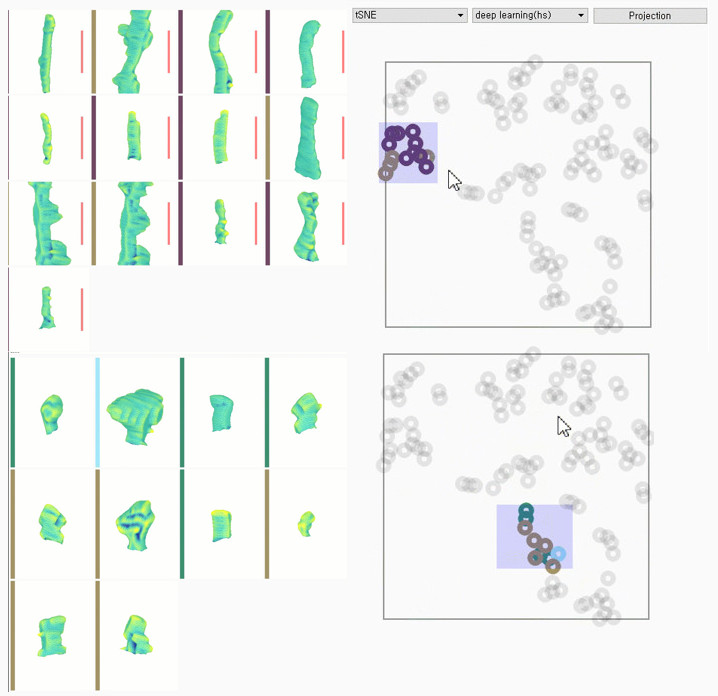

# Spine Extractor
## Problem

**New Taxonomy is needed for Dendrite Spine by using 3D Mesh**

The dendritic spines are classified according to their shape as follows;
filopdium, stubby, thin, and mushroom.
However, given the dynamic appearance of spine through living cell images
and the varying degrees of change in size and shape from time to time,
it appears to be more diverse than the taxonomic form.

Those 4 shape taxonomy is made from 2D spine image.
If we construct 3D mesh by stacking 2D spine images, much various shape are observed.

The purpose of this task is clustering meshes and helps to construct new taxonomy by visualization.
In this repository, feature extraction from 3D point cloud is done before visualization.

## Dataset

There are 112 dendrite meshes.

Each dendrite is labeled as thin, stubby, mushroom, irregular and undefined shape.
This meshes are already normalized and smoothed by preprocessing.

## Method

To extract features from 3D data, point cloud data type is a good option.

Instead of point cloud, we can use graph based on mesh.
However, constructing optimal graph structure from meshes are still ongoing-research.
To convert graph from mesh, we need to consider graph's node features and edge features,
such as right face, left face, angle, normal vector and so on.

Point cloud is simple, but contains fluent features from 3D meshes.
For preprocessing, mesh is normalized into [-1, 1] per each axis, and sample point with uniform distribution.

Upon the state of the art point cloud network([3D Point Capsule Networks](https://arxiv.org/pdf/1812.10775v2.pdf)),
the 10 prior knowledges(length, head diameter, spine area, ...) is encoded to guid the model.
In addition, the attention is used for merging prior knowledge and features from point cloud.

## Result
### Chamfer Loss

### Clustering

As the result, chamfer loss is much lower than non-prior encoded PointCapsNet and Simillar shapes are clustered.
(brown: irregular, purple: thin, green: stub, mint: mushroom)